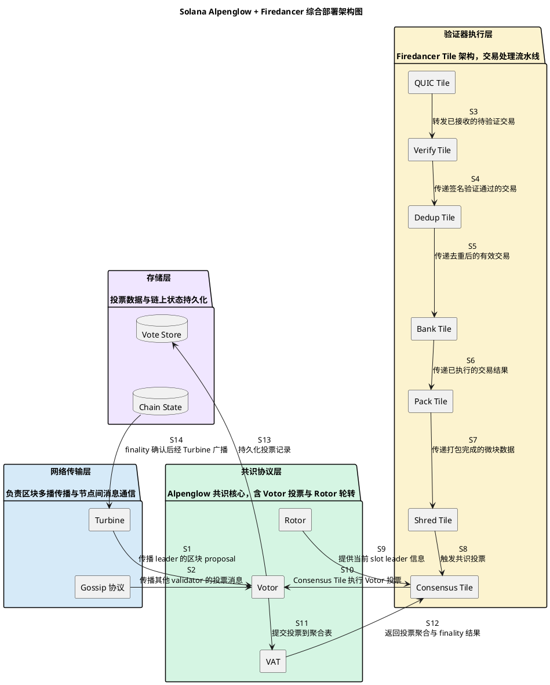

## 目录

- [摘要](#摘要)
- [术语表](#术语表)
- [比较标准](#比较标准)
- [横向对比矩阵](#横向对比矩阵)
  - [维度一：优化层次](#维度一优化层次)
  - [维度二：延迟降低机制](#维度二延迟降低机制)
  - [维度三：性能贡献](#维度三性能贡献)
  - [维度四：部署与成熟度](#维度四部署与成熟度)
- [协同分析](#协同分析)
  - [协同架构](#协同架构)
  - [端到端交易流程](#端到端交易流程)
  - [协同效应分析](#协同效应分析)
  - [可能的非叠加场景](#可能的非叠加场景)
- [场景评估](#场景评估)
  - [场景一：高吞吐低延迟 DeFi 交易](#场景一高吞吐低延迟-defi-交易)
  - [场景二：支付和即时结算](#场景二支付和即时结算)
  - [场景三：高拜占庭比例环境](#场景三高拜占庭比例环境)
  - [场景四：资源受限节点](#场景四资源受限节点)
- [趋势判断](#趋势判断)
  - [趋势一：共识层与执行层优化走向正交解耦](#趋势一共识层与执行层优化走向正交解耦)
  - [趋势二：客户端多样性成为网络弹性的基础设施](#趋势二客户端多样性成为网络弹性的基础设施)
  - [趋势三：Solana sub-150ms finality 设定了自身历史新基线](#趋势三solana-sub-150ms-finality-设定了自身历史新基线)
  - [趋势四：Firedancer 与 Alpenglow 可能存在深度协同优化](#趋势四firedancer-与-alpenglow-可能存在深度协同优化)
- [证据](#证据)
- [追踪链](#追踪链)
- [待决问题](#待决问题)

## 摘要

本 synthesis 综合分析 Solana 在 2025-2026 年围绕共识速度和交易 finality 的整体性能提升工作，基于 Alpenglow 共识协议优化和 Firedancer 验证器客户端两个 primitive 的研究结果进行横向综合分析。

Alpenglow 从共识协议层面替换了原有的 PoH + Tower BFT 组合，通过 off-chain 投票、VAT 聚合和 PoH 移除实现从 12-15 秒到 100-150ms 的中位 finality 目标 [SRC:primitive_blockchain-consensus_solana-alpenglow/draft.md]。Firedancer 从执行层通过 Tile 架构、核心绑定、零拷贝数据路径和用户态网络栈实现百万级 TPS 处理能力 [SRC:primitive_blockchain-validator_firedancer/draft.md]。两者协同工作，Firedancer 的低延迟执行路径为 Alpenglow 的快速投票提供基础设施支撑，共同实现 sub-150ms finality [SRC:primitive_blockchain-validator_firedancer/draft.md]。

## 术语表

| 术语 | 定义 |
|---|---|
| Alpenglow | Solana 新一代共识协议（通过 SIMD-0326 规范化），替换 PoH + Tower BFT |
| Votor | Alpenglow 核心 off-chain 投票协议，决定区块是否达成 finality |
| Rotor | Alpenglow 轮转调度机制，决定每 slot 的 leader 选择 |
| VAT | Vote Aggregation Table，链下投票聚合表，聚合和验证投票权重 |
| Firedancer | Jump Crypto 从零开发的独立 Solana 验证器客户端 |
| Tile | Firedancer 独立处理单元（进程），绑定 CPU 核心，实现并行处理 |
| Agave | Solana 官方验证器客户端（原 solana-validator） |
| PoH | Proof of History，Solana 原有可验证延迟函数时钟（已被 Alpenglow 替换） |
| Tower BFT | Solana 原有链上投票 BFT 机制（已被 Alpenglow 替换） |
| Turbine | Solana 区块多播传播协议 |
| Gossip | Solana P2P 消息广播网络，传播投票和共识消息 |
| Finality | 交易不可逆确认；Alpenglow 目标 100-150ms 中位 finality |
| 20+20 Resilience | 同时容忍 20% 拜占庭和 20% 离线节点的容错能力 |

## 比较标准

基于研究目标，本次 synthesis 固定以下四个核心比较维度：

| 维度 | 说明 | 与比较目的的关联 |
|---|---|---|
| 优化层次 | 各自在系统栈中的定位和优化方向 | 回答各自对共识速度和交易 finality 的提升贡献 |
| 延迟降低机制 | 各自如何减少交易从提交到 finality 的时间 | 回答两者协同工作时的叠加效应和相互依赖 |
| 性能贡献 | 对吞吐量和 finality 的量化贡献 | 回答综合性能提升和网络性能定位 |
| 部署与成熟度 | 当前部署状态、时间线和风险 | 回答 2026 年整体路线图 |

## 横向对比矩阵

### 维度一：优化层次

| 维度 | Alpenglow | Firedancer |
|---|---|---|
| 优化层次 | 共识协议层（协议替换） | 执行层（客户端实现重写） |
| 核心变化 | 从 PoH + Tower BFT 替换为 Votor off-chain 投票 + Rotor 轮转 + VAT 聚合 [SRC:primitive_blockchain-consensus_solana-alpenglow/draft.md] | 从多线程共享替换为 Tile 独立进程 + 共享内存 MPMC 队列 + 用户态网络栈 [SRC:primitive_blockchain-validator_firedancer/draft.md] |
| 架构模式变化 | 从"链上时间序 + 链上投票"变为"slot 调度 + off-chain 投票聚合"，是协议级别的根本替换 [SRC:primitive_blockchain-consensus_solana-alpenglow/draft.md] | 从 tokio 异步运行时替换为核心绑定进程 + 零拷贝数据路径，是实现级别的性能重写 [SRC:primitive_blockchain-validator_firedancer/draft.md] |
| 与对方关系 | 协议层规范，与客户端实现无关，但依赖执行层提供低延迟投票路径 [SRC:primitive_blockchain-consensus_solana-alpenglow/draft.md] | 执行载体，通过 Consensus Tile 实现 Alpenglow 协议的投票逻辑 [SRC:primitive_blockchain-validator_firedancer/draft.md] |
| 影响的延迟环节 | 共识决策延迟（从多 slot 等待缩短到单 slot 内完成） [SRC:primitive_blockchain-consensus_solana-alpenglow/draft.md] | 交易处理延迟（从内核网络栈 + 多线程替换为用户态 + 进程隔离零拷贝） [SRC:primitive_blockchain-validator_firedancer/draft.md] |

### 维度二：延迟降低机制

| 延迟环节 | Alpenglow 的贡献 | Firedancer 的贡献 |
|---|---|---|
| 交易接收 | 不涉及 | QUIC Tile 用户态 QUIC 协议处理，避免内核网络栈开销 [SRC:primitive_blockchain-validator_firedancer/draft.md] |
| 签名验证 | 不涉及 | Verify Tile 可水平扩展，多实例并行 Ed25519 验证 [SRC:primitive_blockchain-validator_firedancer/draft.md] |
| 去重 | 不涉及 | Dedup Tile 高效无锁哈希表去重 [SRC:primitive_blockchain-validator_firedancer/draft.md] |
| 交易执行 | 不涉及 | Bank Tile 通过账户锁分区实现部分并行执行 [SRC:primitive_blockchain-validator_firedancer/draft.md] |
| 交易打包 | 不涉及 | Pack Tile 根据优先级和费用选择最优组合 [SRC:primitive_blockchain-validator_firedancer/draft.md] |
| 区块传播 | 保留 Turbine 多播树，不涉及改动 | Shred Tile 高效编码和分发 [SRC:primitive_blockchain-validator_firedancer/draft.md] |
| 投票生成 | Votor 协议定义 off-chain 投票逻辑 [SRC:primitive_blockchain-consensus_solana-alpenglow/draft.md] | Consensus Tile 提供低延迟投票路径，绑定独立 CPU 核心 [SRC:primitive_blockchain-validator_firedancer/draft.md] |
| 投票传播 | 通过 Gossip 网络传播投票消息 [SRC:primitive_blockchain-consensus_solana-alpenglow/draft.md] | 依赖 Gossip 网络层（与 Alpenglow 共享） |
| 投票聚合 | VAT 在链下集中聚合投票权重，避免链上交易确认延迟 [SRC:primitive_blockchain-consensus_solana-alpenglow/draft.md] | Consensus Tile 处理 VAT 返回的聚合结果，在本地进程内完成 [SRC:primitive_blockchain-validator_firedancer/draft.md] |
| 时间源 | 移除 PoH 时钟，改用 Rotor slot 调度 [SRC:primitive_blockchain-consensus_solana-alpenglow/draft.md] | 不涉及（依赖协议层时间源） |

### 维度三：性能贡献

| 指标 | Alpenglow | Firedancer |
|---|---|---|
| Finality 时间 | 中位 100-150ms（理想网络条件可达 100ms），相比原 Tower BFT 的 12-15 秒提升约 80-150 倍 [SRC:primitive_blockchain-consensus_solana-alpenglow/draft.md] | 不直接降低 finality 时间，但为 Alpenglow 的快速投票路径提供基础设施支撑 [SRC:primitive_blockchain-validator_firedancer/draft.md] |
| 吞吐量 | 不直接影响吞吐量（吞吐量主要受执行层约束） | 测试网 600,000+ TPS（[原始等级: L3]），主网目标 1,000,000 TPS [SRC:primitive_blockchain-validator_firedancer/draft.md] |
| 容错能力 | 20+20 resilience（20% 拜占庭 + 20% 离线） [SRC:primitive_blockchain-consensus_solana-alpenglow/draft.md] | 独立客户端实现，降低网络单点故障风险 [SRC:primitive_blockchain-validator_firedancer/draft.md] |
| 延迟降低来源 | Off-chain 投票（避免链上交易延迟）+ VAT 聚合（单 slot 内决策）+ PoH 移除（减少计算开销） [SRC:primitive_blockchain-consensus_solana-alpenglow/draft.md] | 核心绑定（避免上下文切换）+ 零拷贝（避免数据复制）+ 用户态网络栈（避免内核切换）+ 水平扩展（并行签名验证） [SRC:primitive_blockchain-validator_firedancer/draft.md] |
| 网络弹性 | 20+20 resilience 阈值低于经典 BFT 33%，反映 off-chain 投票模型下的保守估计 [SRC:primitive_blockchain-consensus_solana-alpenglow/draft.md] | Agave + Firedancer 共存时，不同实现 bug 不会导致全网分叉 [SRC:primitive_blockchain-validator_firedancer/draft.md] |

### 维度四：部署与成熟度

| 维度 | Alpenglow | Firedancer |
|---|---|---|
| 提案/实现状态 | SIMD-0326 已提交，白皮书 v1.0/v1.1 已发布 [SRC:primitive_blockchain-consensus_solana-alpenglow/draft.md] | 主网已上线（Firedancer 1.0），50,000+ blocks 无事故 [SRC:primitive_blockchain-validator_firedancer/draft.md] |
| 测试网部署 | 具体时间线未官方确认 [SRC:primitive_blockchain-consensus_solana-alpenglow/draft.md] | 2025 上半年已完成测试网部署和压力测试 [SRC:primitive_blockchain-validator_firedancer/draft.md] |
| 主网部署 | 2025-2026 年规划窗口，但具体激活时间线未确认 [SRC:primitive_blockchain-consensus_solana-alpenglow/draft.md] | 2025 年底主网上线已完成，2026 年处于大规模采用阶段 [SRC:primitive_blockchain-validator_firedancer/draft.md] |
| 关键不确定性 | SIMD 提案审批状态、测试网结果未公开 [SRC:primitive_blockchain-consensus_solana-alpenglow/draft.md] | Consensus Tile 与 Alpenglow 内部接口细节未完整披露 [SRC:primitive_blockchain-validator_firedancer/draft.md] |

## 协同分析

### 协同架构

Alpenglow 和 Firedancer 不是两个独立的优化，而是在系统栈中形成互补的协同关系。综合部署架构展示了它们如何在同一验证器节点内协同工作：

<!-- verified-diagram: solana-integrated-arch -->


四层架构中，网络传输层（Turbine + Gossip）是共享基础设施，共识协议层（Alpenglow）定义投票逻辑，验证器执行层（Firedancer Tiles）提供低延迟执行路径，存储层持久化投票和链上状态。关键交互链路包括 S8→S10（Shred Tile 触发 Consensus Tile 执行 Votor 投票）、S11→S12（VAT 聚合后返回 finality 结果到 Consensus Tile），这两条链路构成了共识层和执行层的协同核心。

### 端到端交易流程

从交易提交到最终确认的端到端流程展示了两个组件如何在实际路径中协同：

<!-- verified-diagram: solana-e2e-flow -->
```plantuml

skinparam nodesep 25
skinparam ranksep 35

box "客户端" #DDDDDD
  actor "客户端" as client
endbox
|||
box "Firedancer 验证器" #EEEEEE
  participant "QUIC Tile" as fd_quic_tile
  participant "Verify Tile" as fd_verify_tile
  participant "Dedup Tile" as fd_dedup_tile
  participant "Bank Tile" as fd_bank_tile
  participant "Pack Tile" as fd_pack_tile
  participant "Shred Tile" as fd_shred_tile
  participant "Consensus Tile" as fd_consensus_tile
endbox
|||
box "网络与共识" #FFFFFF
  participant "Turbine" as turbine
  participant "其他验证器" as other_validators
  participant "VAT" as vat
endbox

client -> fd_quic_tile : M1 通过 QUIC 连接提交交易
activate fd_quic_tile
fd_quic_tile -> fd_verify_tile : M2 转发待验证交易
activate fd_verify_tile
fd_verify_tile -> fd_dedup_tile : M3 传递签名验证通过的交易
activate fd_dedup_tile
fd_dedup_tile -> fd_bank_tile : M4 传递去重后的有效交易
activate fd_bank_tile
fd_bank_tile -> fd_pack_tile : M5 传递已执行的交易结果
activate fd_pack_tile
fd_pack_tile -> fd_shred_tile : M6 传递打包完成的微块
activate fd_shred_tile
fd_shred_tile -> fd_consensus_tile : M7 触发 Alpenglow 共识投票
activate fd_consensus_tile
fd_shred_tile ->> turbine : M8 Shred 经 Turbine 多播传播
deactivate fd_shred_tile
turbine ->> other_validators : M9 广播区块 proposal 到全网
activate other_validators
other_validators ->> vat : M10 提交 Votor 投票到聚合表
activate vat
vat --> fd_consensus_tile : M11 通知 finality 达成
deactivate vat
deactivate other_validators
deactivate fd_consensus_tile
deactivate fd_pack_tile
deactivate fd_bank_tile
deactivate fd_dedup_tile
deactivate fd_verify_tile
deactivate fd_quic_tile

@enduml
```

端到端流程中，M1-M7 全部在 Firedancer 验证器内部完成（交易接收→签名验证→去重→执行→打包→分片→触发共识），这是 Firedancer 的性能贡献区间。M8-M11 进入网络与共识层（Turbine 传播→其他验证器投票→VAT 聚合→finality 通知），这是 Alpenglow 协议的性能贡献区间。整体 finality 时间由两个环节串联组成：`T_finality = T_execution + T_consensus`，其中 `T_execution` 由 Firedancer 的 Tile 流水线效率决定，`T_consensus` 由 Alpenglow 的 off-chain 投票 + VAT 聚合效率决定 [SRC:primitive_blockchain-consensus_solana-alpenglow/draft.md] [SRC:primitive_blockchain-validator_firedancer/draft.md]。

> 异常路径（proposal 验证失败、Nil 状态、Leader 切换、网络分区）未在图中展示，参见 Alpenglow primitive 的状态转换表。

### 协同效应分析

| 协同维度 | 机制 | 效果 |
|---|---|---|
| 投票路径加速 | Firedancer Consensus Tile 绑定独立 CPU 核心，使用零拷贝数据路径，为 Alpenglow 的 Votor 投票提供低延迟执行路径 [SRC:primitive_blockchain-validator_firedancer/draft.md] | 投票生成和处理的延迟最小化，不成为 finality 瓶颈 |
| 协议与实现解耦 | Alpenglow 是协议层规范，与客户端实现无关；Firedancer 是该协议的独立高性能实现 [SRC:primitive_blockchain-consensus_solana-alpenglow/draft.md] | Alpenglow 的性能目标不依赖特定客户端，Firedancer 可在标准接口上充分发挥硬件优势 |
| 吞吐量与 finality 解耦 | Alpenglow 专注于降低 finality 时间（100-150ms），不直接影响吞吐量；Firedancer 专注于提升吞吐量（600K-1M TPS），不改变共识协议 [SRC:primitive_blockchain-consensus_solana-alpenglow/draft.md] [SRC:primitive_blockchain-validator_firedancer/draft.md] | 两个优化正交叠加，同时提升吞吐量和 finality |
| 客户端多样性保障 | Agave 和 Firedancer 共存时，Alpenglow 协议对两种客户端同等适用 [SRC:primitive_blockchain-consensus_solana-alpenglow/draft.md] | 即使 Firedancer 存在实现缺陷，网络仍可通过 Agave 客户端维持共识活性 |

### 可能的非叠加场景

在以下场景中，两者的协同效果可能受限：

- **网络瓶颈**：如果 Turbine 或 Gossip 网络传播延迟过大，即使 Alpenglow 投票逻辑和 Firedancer 执行路径足够快，整体 finality 仍受网络传播时间限制 [SRC:primitive_blockchain-consensus_solana-alpenglow/draft.md]
- **混合客户端部署**：如果大部分验证器运行 Agave 而非 Firedancer，Alpenglow 的 finality 目标仍可达成，但网络整体吞吐量提升有限 [SRC:primitive_blockchain-validator_firedancer/draft.md]
- **硬件约束**：Firedancer 的 Tile 架构需要多核 CPU、256GB+ RAM 和 10Gbps+ 网络，在硬件不足的验证器节点上无法发挥性能优势 [SRC:primitive_blockchain-validator_firedancer/draft.md]

## 场景评估

### 场景一：高吞吐低延迟 DeFi 交易

**适用性**：高度适合。Firedancer 的百万级 TPS 处理能力配合 Alpenglow 的 100-150ms finality，能够满足高频 DeFi 交易对吞吐量和确认速度的双重需求 [SRC:primitive_blockchain-consensus_solana-alpenglow/draft.md] [SRC:primitive_blockchain-validator_firedancer/draft.md]。

**限制条件**：实际性能取决于 Firedancer 验证器在网络中的采用率；如果 leader slot 由 Agave 节点执行，该 slot 的吞吐量将低于 Firedancer 基准 [SRC:primitive_blockchain-validator_firedancer/draft.md]。

### 场景二：支付和即时结算

**适用性**：适合。Alpenglow 的 sub-150ms finality 使得 Solana 可以作为即时支付网络使用，接近传统支付网络（如 Visa）的确认延迟 [SRC:primitive_blockchain-consensus_solana-alpenglow/draft.md]。

**限制条件**：PoH 移除后，需要历史时间证明的应用场景可能需要替代方案，具体方案官方未明确 [SRC:primitive_blockchain-consensus_solana-alpenglow/draft.md]。

### 场景三：高拜占庭比例环境

**适用性**：有限适用。Alpenglow 的 20+20 resilience 阈值在拜占庭节点超过 20% 时不再保证安全性，低于经典 BFT 的 33% 阈值 [SRC:primitive_blockchain-consensus_solana-alpenglow/draft.md]。Firedancer 的客户端多样性可以缓解系统性实现缺陷风险，但不改变共识层的容错上限 [SRC:primitive_blockchain-validator_firedancer/draft.md]。

### 场景四：资源受限节点

**适用性**：不适合 Firedancer。Firedancer 需要多核 CPU、256GB+ RAM、NVMe SSD 和 10Gbps+ 网络，在资源受限环境下应使用 Agave 客户端 [SRC:primitive_blockchain-validator_firedancer/draft.md]。Alpenglow 协议本身对客户端硬件没有额外要求。

## 趋势判断

### 趋势一：共识层与执行层优化走向正交解耦

Alpenglow（协议替换）和 Firedancer（实现重写）代表了 Solana 性能优化的两个正交方向。共识层专注于 finality 时间和容错能力，执行层专注于吞吐量和处理延迟。这种解耦使得两个优化可以独立迭代，互不阻塞 [SRC:primitive_blockchain-consensus_solana-alpenglow/draft.md] [SRC:primitive_blockchain-validator_firedancer/draft.md]。

**不确定性（技术未定）**：Alpenglow 的主网部署时间线尚未官方确认，如果 Alpenglow 部署推迟，Firedancer 将继续在 PoH + Tower BFT 共识下运行，其 finality 改善将受限 [SRC:primitive_blockchain-consensus_solana-alpenglow/draft.md]。

### 趋势二：客户端多样性成为网络弹性的基础设施

Firedancer 作为独立实现的第二个客户端，核心价值不仅是性能提升，更是降低 Agave 单点故障风险 [SRC:primitive_blockchain-validator_firedancer/draft.md]。在 2025-2026 年部署阶段，Agave 和 Firedancer 共存是 Solana 网络弹性的关键保障 [SRC:primitive_blockchain-validator_firedancer/draft.md]。

**不确定性（假设条件）**：该趋势假设 Solana 协议规范保持相对稳定，如果频繁出现 Breaking Change，独立维护两个客户端的成本将显著增加 [SRC:primitive_blockchain-validator_firedancer/draft.md]。

### 趋势三：Solana sub-150ms finality 设定了自身历史新基线

Solana 通过 Alpenglow 将 finality 从 12-15 秒缩短到 100-150ms，配合 Firedancer 的百万级 TPS，重新定义了自身历史上的性能基线 [SRC:primitive_blockchain-consensus_solana-alpenglow/draft.md] [SRC:primitive_blockchain-validator_firedancer/draft.md]。

**不确定性（证据不足）**：这一判断基于 Solana 自身的性能目标和第三方分析 [L1: solana-blog-internet-capital-markets] [L2: galaxy-research-firedancer-alpenglow]。此判断仅在 Solana 生态内成立；同类公链（如 Sui、Aptos、Sei）在同期是否也有类似的 finality 优化，本 synthesis 未进行横向对比。

### 趋势四：Firedancer 与 Alpenglow 可能存在深度协同优化

根据 Galaxy Research 分析 [L2: galaxy-research-firedancer-alpenglow] 和 Solana 官方博客 [L1: solana-blog-internet-capital-markets]，Firedancer 的 Consensus Tile 与 Alpenglow 之间可能存在超出标准接口的优化路径，但具体细节未在公开文档中披露 [SRC:primitive_blockchain-validator_firedancer/draft.md]。

**不确定性（信息不足）**：Firedancer 文档和 Alpenglow 规范均未明确描述 Consensus Tile 与 Alpenglow 模块的内部接口细节，是否存在共享内存路径或专用接口尚待确认 [SRC:primitive_blockchain-validator_firedancer/draft.md]。

## 证据

| Claim / Source | 支撑章节 | 置信度 |
|---|---|---|
| Alpenglow 替换 PoH + Tower BFT | 横向对比矩阵-维度一 | high（来自 Alpenglow primitive） |
| Alpenglow 中位 finality 100-150ms | 横向对比矩阵-维度三 | high（来自 Alpenglow primitive, L1） |
| Firedancer Tile 架构 + 零拷贝 | 横向对比矩阵-维度一、二 | high（来自 Firedancer primitive, L1） |
| Firedancer 测试网 600K+ TPS / 主网目标 1M TPS | 横向对比矩阵-维度三 | medium（测试网数值来自 L3） |
| Firedancer 为 Alpenglow 投票提供低延迟基础设施 | 协同分析 | high（来自 Firedancer primitive, L1/L2） |
| Alpenglow 20+20 resilience 低于经典 BFT 33% | 横向对比矩阵-维度三 | high（来自 Alpenglow primitive, L1） |
| Firedancer 主网已上线，50,000+ blocks 无事故 | 横向对比矩阵-维度四 | medium（来自 L3） |
| Alpenglow 主网部署时间线未官方确认 | 横向对比矩阵-维度四 | low（证据不足） |
| Consensus Tile 与 Alpenglow 内部接口细节未披露 | 趋势判断-趋势四 | low（证据不足） |
| Solana sub-150ms finality 设定自身历史新基线 | 趋势判断-趋势三 | medium（推测性趋势判断） |

## 追踪链

- 来源 change: openspec/changes/synthesis_blockchain-integration_solana-consensus-finality-2026/
- Request: openspec/changes/synthesis_blockchain-integration_solana-consensus-finality-2026/request.md
- Plan: openspec/changes/synthesis_blockchain-integration_solana-consensus-finality-2026/plan.md
- Draft: openspec/changes/synthesis_blockchain-integration_solana-consensus-finality-2026/draft.md
- Review: openspec/changes/synthesis_blockchain-integration_solana-consensus-finality-2026/review.md
- Publish: openspec/changes/synthesis_blockchain-integration_solana-consensus-finality-2026/publish.md
- 依赖 published artifacts:
  - knowledge/analysis/primitives/blockchain-consensus/solana-alpenglow/artifact.md
  - knowledge/analysis/primitives/blockchain-validator/firedancer/artifact.md

## 待决问题

- Alpenglow 主网部署时间线的官方确认来源
- Alpenglow off-chain 投票在极端网络条件下的完整安全证明
- Firedancer Consensus Tile 与 Alpenglow 模块的内部接口规范
- Firedancer 内部性能基准测试数据（不同硬件配置下的 TPS）
- 同类公链在同期的 finality 优化进展
