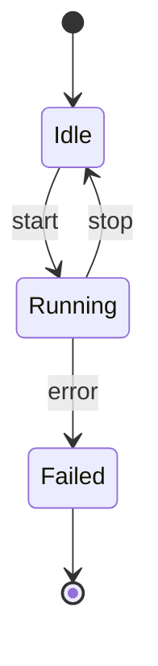
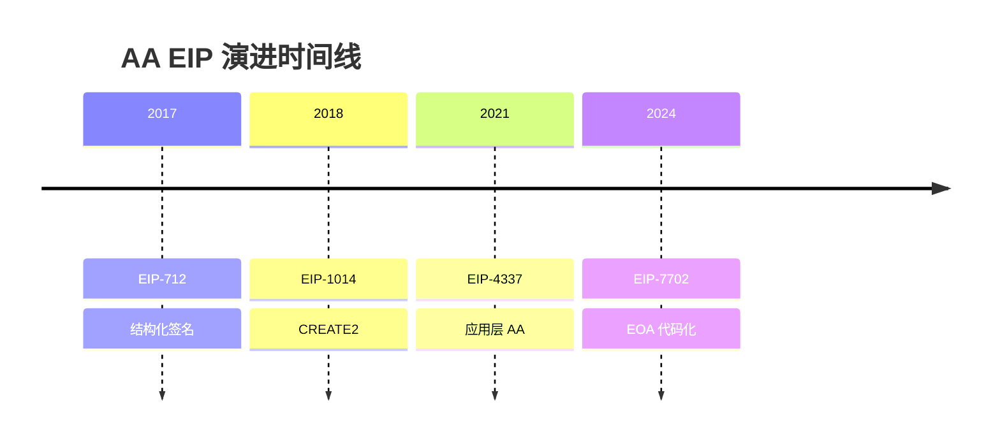

<!-- 目录 -->
- [概述](#概述)
- [关键术语](#关键术语)
- [分析正文](#分析正文)
- [设计取舍](#设计取舍)
- [边界与前提](#边界与前提)
- [相关对象关系](#相关对象关系)
- [结论](#结论)
- [待确认问题](#待确认问题)
- [参考资料](#参考资料)

## 概述

<!--
用 2-3 段说明：这个研究对象是什么、解决什么问题、为什么重要

类型适配：
- primitive：说明机制背景和研究范围
- synthesis：说明演进背景和框架目标
- domain：说明主题域的范围和问题簇
- decision：说明决策场景和比较目标
-->

## 关键术语

| 术语 | 定义 | 在本题中的作用 |
|------|------|---------------|
| | | |

## 分析正文

<!--
根据研究类型，分析正文结构有所不同：

### 图表优先原则

**所有章节必须遵循图表优先原则**：

1. 能可视化的内容必须先展示图表
2. 文字只补充图中不易表达的细节（设计原因、trade-off、边界情况）
3. 禁止用大段文字完整复述图表已清晰表达的内容

### 分层图表策略

**复杂主题必须采用分层图表策略**：

1. 主框架图：展示整体演进脉络/架构全景
2. 子阶段图：每个关键阶段/子模块有自己的详细图表
3. 对比表格：特性对比、能力归属等结构化信息优先用表格

### PlantUML 支持范围（重要）

**本仓库正式支持的 PlantUML 类型仅限**：

| 类型 | 用途 | 生成方式 |
|------|------|----------|
| **Architecture Diagram**（架构图/组件图） | 系统架构、组件分层、模块关系 | 必须通过全局 skill `feipi-plantuml-generate-architecture-diagram` |
| **Sequence Diagram**（时序图/交互图） | 交互流程、调用链路、消息时序 | 必须通过全局 skill `feipi-plantuml-generate-sequence-diagram` |

**Unsupported Types（不支持的 PlantUML 类型）**：

以下类型**没有** dedicated skill 支持，**不得**使用 PlantUML 手写交付：

| 类型 | 推荐 Fallback |
|------|---------------|
| State Diagram（状态机图） | Mermaid stateDiagram / Markdown 表格 / ASCII 草图 |
| Activity Diagram（活动图） | Mermaid flowchart / Markdown 表格 / ASCII 草图 |
| Deployment Diagram（部署图） | Mermaid deployment / Markdown 表格 / ASCII 草图 |
| 比较总览图 | Markdown 表格 / ASCII 草图 |
| 时间线 | Mermaid timeline / Markdown 表格 |

详见：`openspec/specs/diagram-policy/spec.md`

### PlantUML Diagram Contract Comment（正式交付必需）

**所有 PlantUML block 前必须有紧邻的 contract comment**：

```markdown
<!-- verified-diagram: package=./diagrams/<diagram-id>/validation.json puml=./diagrams/<diagram-id>/diagram.puml sha256=<sha256> -->

```

**校验命令**：
```bash
python3 scripts/research/validate_draft_diagram_contract.py <change-dir>/draft.md
```

**无 contract comment 的 PlantUML block 视为手写，draft 不得完成**。

### primitive 类型

#### 组件架构

必须先画组件图，说明：
- 有哪些核心组件
- 每个组件位于哪一层（协议层/基础设施层/应用层）
- 谁负责/控制这个组件

**生成方式**：
使用 `feipi-plantuml-generate-architecture-diagram` skill 生成组件图。

**交付要求**：
- 必须产出 diagram package（`diagrams/<id>/validation.json` + `diagram.puml` + `diagram.svg`）
- `validation.json` 必须显示 `final_status=success` 且 `render_result=ok`
- PlantUML block 前必须有 contract comment

```markdown
<!-- verified-diagram: package=./diagrams/arch-overview/validation.json puml=./diagrams/arch-overview/diagram.puml sha256=abc123... -->

```

#### 核心流程

时序图（如必要），展示关键交互流程

**生成方式**：
使用 `feipi-plantuml-generate-sequence-diagram` skill 生成。

**交付要求**：
- 必须产出 diagram package
- `validation.json` 必须显示 `final_status=success` 且 `render_result=ok`
- PlantUML block 前必须有 contract comment

**流程步骤说明**（与图中序号对应）：

- 必须使用无序列表，不能用有序列表
- 使用 【S1→S3】格式与图中序号关联，如：【S1→S3】Bundler 模拟验证机制...
- 不要重复完整流程文字，而是针对重点流程补充说明
- 每个要点聚焦一个关键机制或设计决策

- 【S1→Sn】**关键步骤说明**：补充说明该步骤的核心机制或设计原因

#### 状态机图（如需要）

**注意**：状态机图**无** dedicated skill 支持，**不得使用 PlantUML**。

**推荐 Fallback**：

1. **Mermaid stateDiagram**（首选）



2. **Markdown 表格**（结构化）

| 当前状态 | 触发事件 | 转换结果 | 说明 |
|----------|----------|----------|------|
| Idle | start | Running | 启动 |
| Running | stop | Idle | 停止 |

3. **ASCII 草图**（快速说明）

```
[*] --> Idle --> Running --> Failed --> [*]
```

### synthesis 类型

#### 演进框架

**主时间线图**（必须）：展示完整演进脉络

**生成方式**：
- 复杂演进：使用 `feipi-plantuml-generate-architecture-diagram` skill
- 简单时间线：Mermaid timeline 或 Markdown 表格

**要求**：
- 展示所有核心对象的时间线位置
- 标注问题层（infrastructure/authorization/execution/protocol）
- 展示演进的阶段划分

**Mermaid 时间线示例**：



**子阶段图**（推荐）：每个关键阶段有自己的详细图表

**演进阶段说明**（文字补充）：
- 只补充图中不易表达的设计原因和 trade-off
- 说明阶段划分的依据
- 不要重复时间线已展示的年月信息

#### 问题层分布

**问题层分布图**（必须）：展示各对象解决的问题层

使用表格或组件图，清晰展示：
- 各对象的问题层归属
- 同一问题层的不同方案
- 跨层依赖关系

**Markdown 表格示例**：

| EIP | 问题层 | 解决方案 |
|-----|--------|----------|
| EIP-712 | Infrastructure | 结构化签名 |
| EIP-4337 | Execution | Alt mempool |

#### 各对象定位

**对比表格**（必须）：

| 对象 | 一句话定位 | 问题层 | 当前状态 | 与基准关系 |
|------|-----------|--------|----------|-----------|
| | | | | |

#### 演进关系分析

**演进关系图**（必须）：展示对象间的演进、竞争、互补关系

**生成方式**：
- 复杂关系：使用 `feipi-plantuml-generate-architecture-diagram` skill
- 简单关系：Mermaid graph 或 ASCII 草图

**文字补充**（只补充图中不易表达的）：
- 为什么不是简单替代链
- 各路径的适用场景
- 演进规律总结

### domain 类型

#### 问题簇划分

| 问题簇 | 核心问题 | 相关对象 |
|--------|----------|----------|
| | | |

#### 与相邻 domain 关系

- 上游 domain
- 下游 domain
- 平行 domain

### decision 类型

#### 场景定义

- 具体场景描述
- 约束条件
- 决策目标

#### 比较维度

| 维度 | 标准定义 | 验证方式 |
|------|----------|----------|
| | | |

#### 选项分析

| 选项 | 优势 | 劣势 | 适用条件 |
|------|------|------|----------|
| | | | |
-->

## 设计取舍

<!--
回答为什么这样设计，而不是那样设计。
对比不同方案的优劣。

primitive 类型必须包含：
- 为什么不选择替代方案
- 关键设计决策的 trade-off

synthesis 类型建议包含：
- 演进路径选择的原因
- 为什么不是简单替代
-->

## 边界与前提

<!--
明确区分：
- 协议原生能力与外部依赖
- live / planned / promotional
- 能解决什么 / 不能解决什么

primitive 类型必须包含能力边界说明：
- 哪些能力由协议本身保证
- 哪些能力依赖外部组件或服务

synthesis 类型建议包含：
- 演进分析的边界（时间范围、对象范围）
- 不能下的结论（如：不能断言某对象完全替代另一对象）
-->

## 相关对象关系

<!--
与上游、下游、替代、互补对象的关系

primitive 类型：与相邻协议的关系定位
synthesis 类型：演进关系分析
domain 类型：与相邻 domain 的边界
decision 类型：各选项的对比关系
-->

## 结论

<!--
当前可以成立的有限结论

要求：
- 只能写 bounded conclusions，不得写绝对化判断
- 必须标注证据等级（L1-L4）
- 区分"已确认"、"尚需验证"、"基于推断"

示例：
- 【L1 证据】EIP-4337 是应用层账户抽象方案
- 【L2 证据】EntryPoint 合约已部署到主网
- 【L3 证据，需降级】EIP-7560 可能在未来 3-5 年实现
-->

## 待确认问题

<!--
plan 阶段标记的未决问题，draft 阶段尝试回答但仍不确定的

列出：
- 已解决的问题（标注"已解决"）
- 仍未解决的问题（标注"未解决"，并说明原因）
- 新发现的问题
-->

## 参考资料

| 来源 | 说明 |
|------|------|
| | |
