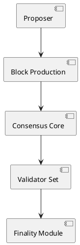
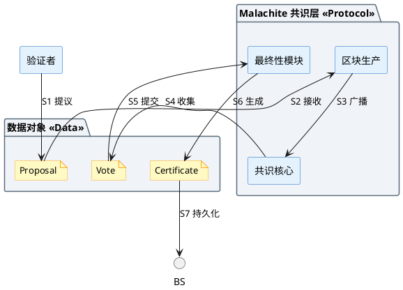

# 架构组件图质量规约

## 目的

定义 PlantUML 架构组件图的质量标准，确保组件图能够清晰区分**组件**、**数据**、**角色**和**边界**，避免所有元素使用相同格式。

## 核心问题

**当前问题**：所有元素使用相同的矩形框和颜色，无法区分：
- 组件（Component）vs 数据（Data Artifact）
- 内部元素（Internal）vs 外部角色（External Actor）
- 存储（Storage）vs 处理（Processing）
- 协议层（Protocol）vs 应用层（Application）

## 质量要求

### 1. 元素类型区分（必须）

架构组件图必须使用不同的形状/颜色区分以下元素类型：

| 元素类型 | 形状 | 颜色 | PlantUML 语法 | 示例 |
|----------|------|------|---------------|------|
| **组件 (Component)** | 矩形 | 蓝色系 | `component [名称]` | 共识引擎、验证器模块 |
| **外部角色 (Actor)** | 人形 | 灰色系 | `actor [名称]` | 用户、管理员、验证者 |
| **数据存储 (Storage)** | 圆柱体 | 绿色系 | `database [名称]` | 区块存储、状态数据库 |
| **数据对象 (Data)** | 矩形（note） | 黄色系 | `note "名称" as 别名` | Proposal、Vote、Certificate |
| **接口/边界 (Interface)** | 圆形 | 橙色系 | `[名称] as 名称 <<接口>>` | API、RPC 端点 |
| **队列/通道 (Queue)** | 队列形状 | 紫色系 | `queue [名称]` | 消息队列、交易池 |

**注意**：PlantUML 不支持通过 stereotype 改变组件颜色，数据对象需使用 `note` 元素表示。

### 2. 分层着色（必须）

组件图必须通过背景色或 package 边界区分层次，并使用 `top to bottom direction` 纵向布局：

```plantuml
@startuml
skinparam componentStyle rectangle

' 纵向布局
top to bottom direction
skinparam nodesep 25
skinparam ranksep 35

' 定义配色方案
skinparam package {
    BackgroundColor #F0F4F8
    BorderColor #5A6C7D
}

skinparam component {
    BackgroundColor #E3F2FD
    BorderColor #1565C0
}

skinparam database {
    BackgroundColor #C8E6C9
    BorderColor #2E7D32
}

skinparam actor {
    BackgroundColor #E0E0E0
    BorderColor #424242
}

skinparam note {
    BackgroundColor #FFF9C4
    BorderColor #F9A825
}

package "共识层 <<Protocol>>" {
    component [共识引擎]
}

package "数据对象 <<Data>>" {
    note "Proposal" as P
}

actor [验证者] as V

V --> P : S1 提议
@enduml
```



### 3. 箭头语义（必须）

箭头必须标注语义，区分不同类型的关系：

| 关系类型 | 箭头样式 | 标注 | 说明 |
|----------|----------|------|------|
| **调用/请求** | 实线箭头 | `: 请求内容` | 组件间调用 |
| **数据流** | 虚线箭头 | `: 数据名称` | 数据传递 |
| **依赖** | 虚线无箭头 | `..` | 编译时依赖 |
| **创建** | 虚线箭头 + create | `create` | 创建新对象 |
| **生命周期** | 实线 + 销毁标记 | `destroy` | 销毁对象 |

### 4. 组件内聚（推荐）

每个组件应满足：
- **单一职责**：一个组件只做一件事
- **明确边界**：输入输出清晰
- **可解释性**：组件名称能说明其作用

### 5. 视觉层次（推荐）

- **核心组件**：放在图中央，使用更醒目的颜色
- **辅助组件**：放在边缘，使用较淡的颜色
- **外部依赖**：放在边界外，使用灰色

## 检查清单

在提交组件图前，必须完成以下检查：

### 基础检查（必须）

- [ ] 组件和数据使用了不同的形状/颜色
- [ ] 外部角色使用了 actor 语法
- [ ] 数据存储使用了 database 语法
- [ ] 所有箭头都有标注说明
- [ ] 有明确的分层边界（package）

### 进阶检查（推荐）

- [ ] 配色方案一致
- [ ] 核心组件在视觉中心
- [ ] 图例说明完整
- [ ] 组件数量适中（5-9 个）

## 示例：好的 vs 坏的

### 坏的示例



**问题**：
1. 所有元素形状相同，无法区分组件和数据
2. 没有分层边界
3. 箭头无标注
4. 无法识别外部角色

### 好的示例



**优点**：
1. 组件使用蓝色矩形，数据使用黄色 note，角色使用 actor
2. 通过 package 明确分层
3. 箭头有清晰标注（S1-S7）
4. 配色一致，视觉层次清晰
5. 使用 `top to bottom direction` 纵向布局

## 配色方案参考

### 蓝色系（组件）

```plantuml
skinparam component {
    BackgroundColor#E3F2FD    ' 浅蓝背景
    BorderColor#1976D2        ' 深蓝边框
}
```

### 绿色系（数据/存储）

```plantuml
skinparam database {
    BackgroundColor#E8F5E9    ' 浅绿背景
    BorderColor#388E3C        ' 深绿边框
}
```

### 灰色系（外部角色）

```plantuml
skinparam actor {
    BackgroundColor#F5F5F5    ' 浅灰背景
    BorderColor#757575        ' 深灰边框
}
```

## 本仓库的默认配色方案

```plantuml
@startuml
skinparam componentStyle rectangle

' 纵向布局
top to bottom direction
skinparam nodesep 25
skinparam ranksep 35

' 配色方案
skinparam package {
    BackgroundColor #F0F4F8
    BorderColor #5A6C7D
}

skinparam component {
    BackgroundColor #E3F2FD
    BorderColor #1565C0
}

skinparam database {
    BackgroundColor #C8E6C9
    BorderColor #2E7D32
}

skinparam actor {
    BackgroundColor #E0E0E0
    BorderColor #424242
}

skinparam note {
    BackgroundColor #FFF9C4
    BorderColor #F9A825
}

legend right
  |= 元素 |= 说明 |
  | 蓝色矩形 | 组件 |
  | 黄色 note | 数据对象 |
  | 绿色圆柱 | 数据存储 |
  | 灰色人形 | 外部角色 |
endlegend

@enduml
```



## PlantUML Server 校验

本仓库使用本地 PlantUML server（端口 8199）进行校验。

**校验命令**：
```bash
bash scripts/check_plantuml.sh <input.puml> --svg-output <output.svg>
```

**输出**：
- `syntax_result=ok` - 语法通过
- `syntax_result=error` - 语法错误

**常见问题**：
1. 如果 server 不可达，检查 `nc -z localhost 8199` 是否成功
2. 如果 SVG 生成失败，检查 PlantUML 代码是否包含非法字符

## 相关文件

- `openspec/specs/diagram-policy/spec.md`：图表总政策
- `skills/feipi-gen-plantuml-code/`：PlantUML 生成 skill
