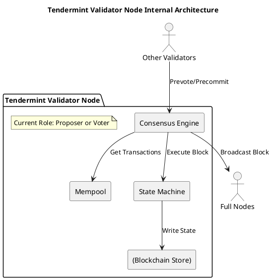
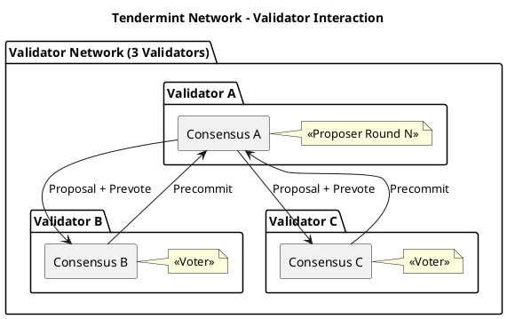

# 架构组件图抽象层级规约

## 目的

定义架构组件图中**组件抽象层级**的要求，确保图中组件处于同一抽象维度，避免将**整体与部分**、**角色与系统**混为一谈。

## 核心问题

### 问题 1：维度混用

**错误示例**：
```plantuml
package "Tendermint Consensus" {
  [Proposer] as P          ' 角色（节点的一种功能）
  [Validator Set] as V     ' 角色集合
  [Consensus Engine] as CE ' 模块
  [Application] as APP     ' 外部系统
  [Blockchain] as BC       ' 整体系统
}
```

**问题分析**：
- `Proposer` 是节点的角色，不是独立组件
- `Validator Set` 是角色集合，不是组件
- `Blockchain` 是整体系统，包含 Consensus Engine
- 这些元素**不是同一抽象层级**，不能并列

### 问题 2：重复表示

同一实体在图中多次出现，使用不同名称：
- `Validator` 和 `Validator Set` 实际是同一概念
- `Proposer` 和 `Leader` 实际是同一概念

### 问题 3：上下级关系缺失

没有表达"包含"关系：
- Blockchain **包含** Consensus Engine
- Validator **可以是** Proposer（轮转）

## 抽象层级定义

组件图必须明确表达以下抽象层级：

### Level 1 - 系统边界（System Boundary）

描述系统与外部环境的关系。

**元素类型**：
- 系统本身（如：Tendermint Network）
- 外部系统（如：Application、Client）
- 外部角色（如：User、Operator）

**PlantUML 表示**：
```plantuml
package "Tendermint Network <<system>>" {
    ' 系统内部组件
}

actor "External Application" as App
```

### Level 2 - 节点类型（Node Type）

描述系统内不同类型的节点。

**元素类型**：
- Validator Node（验证者节点）
- Full Node（全节点）
- Light Client（轻节点）

**PlantUML 表示**：
```plantuml
package "Validator Nodes" {
    component [Validator A] as Va
    component [Validator B] as Vb
}
```

### Level 3 - 节点内部（Internal Components）

描述单个节点的内部组件。

**元素类型**：
- Consensus Engine（共识引擎）
- Mempool（内存池）
- Blockchain Store（区块存储）
- State Machine（状态机）

**PlantUML 表示**：
```plantuml
package "Validator Node Internal" {
    component [Consensus Engine] as CE
    component [Mempool] as MP
    component [State Machine] as SM
    database [(Blockchain Store)] as BS
}
```

### Level 4 - 角色/功能（Role/Function）

描述节点在特定时刻扮演的角色。

**元素类型**：
- Proposer（提议者）- 当前轮次的 Leader
- Voter（投票者）- 其他验证者

**重要**：角色**不是独立组件**，是节点的**临时状态**。

**PlantUML 表示**（使用 note 或 stereotype）：
```plantuml
component [Validator A] as Va
note right of Va: Current Proposer
```

## 质量要求

### 1. 单一抽象层级原则（必须）

**每个组件图应聚焦于一个抽象层级**，不要混用多个层级。

| 图类型 | 聚焦层级 | 允许出现的关系 |
|--------|----------|----------------|
| 系统上下文图 | Level 1 | 系统 ↔ 外部实体 |
| 节点部署图 | Level 2 | 节点类型 ↔ 节点类型 |
| 组件结构图 | Level 3 | 组件 ↔ 组件、组件 ↔ 数据存储 |
| 角色流程图 | Level 4 | 角色 ↔ 数据、角色 ↔ 角色 |

### 2. 包含关系显式化（必须）

如果组件 A 包含组件 B，必须使用 package 或注释明确：

```plantuml
package "Tendermint Node" {
    component [Consensus Engine] as CE
    component [Mempool] as MP
}

' 或
[Consensus Engine] as CE <<inside: Tendermint Node>>
```

### 3. 角色与组件分离（必须）

角色（Proposer/Leader）不是固定组件，是**节点的状态**：

```plantuml
' 错误：Proposer 作为独立组件
component [Proposer] as P

' 正确：Proposer 是节点的角色
component [Validator A] as Va
note right of Va: <<Proposer>>
```

### 4. 节点类型明确定义（必须）

对于 BFT 共识，必须区分：

| 节点类型 | 作用 | 是否投票 |
|----------|------|----------|
| Validator | 验证者，参与共识 | 是 |
| Full Node | 全节点，同步状态 | 否 |
| Light Client | 轻节点，验证头部 | 否 |

## 检查清单

在提交组件图前，必须回答以下问题：

### 抽象层级检查（必须）

- [ ] 图中的每个组件属于哪个抽象层级？
- [ ] 是否有混用不同层级的组件？
- [ ] 如果有混用，是否用 package 明确区分？

### 关系检查（必须）

- [ ] Proposer 是哪个 Validator 的角色？
- [ ] Validator Set 包含哪些具体节点？
- [ ] Blockchain 和 Consensus Engine 是什么关系？

### 重复检查（必须）

- [ ] 是否有同一实体的多个名称？
- [ ] Validator 和 Validator Set 是否同时出现？
- [ ] Proposer 和 Leader 是否同时出现？

## 示例：好的 vs 坏的

### 坏的示例（Tendermint）

```plantuml
@startuml
package "Tendermint Consensus" {
  [Proposer] as P          ' 问题：角色，不是组件
  [Validator Set] as V     ' 问题：集合，不是具体节点
  [Consensus Engine] as CE ' 问题：这是节点内部组件
  [Application] as APP     ' 问题：外部系统
  [Blockchain] as BC       ' 问题：整体系统
}

P --> CE : Proposal
V --> CE : Vote
@enduml
```

**问题分析**：
1. 5 个元素分属 4 个不同层级
2. Proposer 是 Validator 的角色，不是独立实体
3. Validator Set 包含 Validator，但 Validator 未出现
4. Blockchain 包含 Consensus Engine，但画成并列关系

### 好的示例（Tendermint - 节点内部视角）



**优点**：
1. 聚焦于**单个 Validator 节点内部**
2. 明确 Proposer/Voter 是角色说明
3. 组件都在 Level 3（节点内部组件）
4. 外部交互清晰（Other Validators、Full Nodes）

### 好的示例（Tendermint - 系统视角）



**优点**：
1. 展示多节点交互
2. 用 note 标注当前角色
3. 每个 Validator 是独立 package
4. 消息流清晰

## 相关文件

- `openspec/specs/architecture-diagram-quality/spec.md`：元素类型区分
- `openspec/specs/diagram-policy/spec.md`：图表总政策
