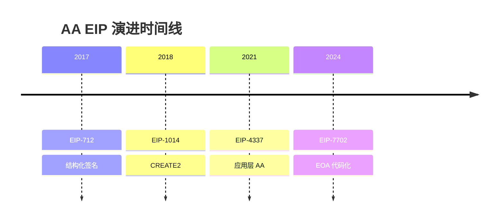

# 图表政策

## 目的

定义本仓库所有研究输出中图表（尤其是 PlantUML）的生成、验证与交付标准，确保所有图表可渲染、可维护，并执行**图表优先、文字补充**的原则。

## 核心原则

### 图表优先原则

**所有研究输出必须遵循图表优先原则**：

1. **先图后文**：能可视化的内容必须先展示图表，再用文字补充图中不易表达的细节
2. **图表承载主干**：演进脉络、架构关系、流程步骤等主干信息必须由图表承载
3. **文字补充细节**：文字只补充图表中不易展示的：
   - 设计原因和 trade-off
   - 失败条件和边界情况
   - 证据等级和不确定性
   - 具体数值和引用来源
4. **禁止文字重复图表**：不得用大段文字完整复述图表已清晰表达的内容

### 分层图表策略

对于复杂主题，必须采用分层图表策略：

1. **主框架图**：展示整体演进脉络/架构全景
2. **子阶段图**：每个关键阶段/子模块有自己的详细图表
3. **对比表格**：特性对比、能力归属等结构化信息优先用表格

## 要求

### 1. 图示方案优先级

**本仓库采用以下图示方案（按优先级排序）**：

#### 第一优先级：PlantUML + Markdown 表格（首选）

**PlantUML**（复杂图首选）：
- **适用场景**：组件架构图、核心流程时序图、复杂关系网络
- **优势**：表达能力强、自动布局、支持复杂交互
- **约束**：必须通过 `/feipi-gen-plantuml-code` skill 生成和校验

**Markdown 表格**（结构化信息首选）：
- **适用场景**：特性对比、时间线、能力归属、状态对比
- **优势**：零依赖、占用空间最小、所有平台完美支持
- **示例**：

| EIP | 年份 | 问题层 | 状态 | 核心创新 | 与 4337 关系 |
|-----|------|--------|------|----------|-------------|
| EIP-712 | 2017 | Infrastructure | Final | 结构化签名 | 基础依赖 |
| EIP-4337 | 2021 | Execution | Final | Alt mempool | 基准方案 |

#### 第二优先级：Mermaid（简单图备选）

**Mermaid**（简单流程图/时序图）：
- **适用场景**：简单流程图、时序图、决策树、时间线
- **优势**：GitHub 原生支持、语法简洁、自动布局
- **约束**：复杂图表达能力弱于 PlantUML

**Mermaid 时间线示例**：



#### 第三优先级：ASCII/Unicode 图（快速草图）

**ASCII 图**（快速草图/简单关系）：
- **适用场景**：快速草图、简单关系、临时说明
- **优势**：零依赖、版本控制友好、任意编辑器可写
- **示例**：

```
Infrastructure (712) ──┐
                       ├──→ Authorization (1271, 3074)
Deployment (1014) ─────┘
```

### 2. 图表类型要求（按优先级选择方案）

**synthesis 类型必须包含的图表**：

- **演进时间线图**（必须）：优先使用 Markdown 表格或 Mermaid timeline，复杂演进用 PlantUML
- **问题层分布图**（必须）：优先使用 Markdown 表格或 Mermaid graph，复杂分层用 PlantUML 组件图
- **演进关系图**（必须）：优先使用 Mermaid 关系图或 PlantUML 组件图
- **阶段子图**（推荐）：每个关键阶段有自己的详细图表（Mermaid 或 PlantUML）
- **对比表格**（必须）：**必须使用 Markdown 表格**（特性对比、状态对比）

**primitive 类型必须包含的图表**：

- **组件架构图**（必须）：**必须使用 PlantUML 组件图**（展示核心组件、层级关系、角色归属）
- **核心流程图**（必须）：**必须使用 PlantUML 时序图**（展示关键交互流程）
- **能力归属表**（必须）：**必须使用 Markdown 表格**（protocol-native / official ecosystem / third-party 分类）
- **子流程图**（推荐）：复杂流程分解为多个子流程时序图（PlantUML 或 Mermaid）

**domain 类型必须包含的图表**：

- **问题簇划分图**（必须）：优先使用 Markdown 表格或 Mermaid graph
- **与相邻 domain 关系图**（必须）：优先使用 Mermaid 关系图或 PlantUML 组件图

### 3. PlantUML 必须通过 skill 生成

- 所有 PlantUML 代码必须通过 `/feipi-gen-plantuml-code` skill 生成
- 禁止直接手写 PlantUML 代码后未经校验就提交
- skill 会自动执行语法校验（`syntax_result=ok`）和布局检查

### 4. 校验标准

- 必须通过 `scripts/check_plantuml.sh` 校验：`syntax_result=ok`
- 必须通过布局检查：`layout_check=ok`
- 必须生成可读的 `.svg` 输出，无文字重叠/遮挡

### 5. 交付物要求

- `draft.md` 中的 PlantUML 必须嵌入代码块（```plantuml）
- 代码块内容必须是 skill 生成的、通过校验的代码
- 不得使用 `participant ... optional` 等非标准语法

### 6. 流程集成

- `build-draft` skill 必须在生成包含 PlantUML 的 draft 时，调用 `feipi-gen-plantuml-code` skill
- `build-draft` skill 的 SKILL.md 必须显式声明此依赖关系

### 7. 问题追溯

- 若发现 PlantUML 编译失败，视为 `build-draft` skill 执行缺陷
- 修复方案：更新 `build-draft/SKILL.md` 的约束条款，而非仅修复单个 draft

## 相关文件

- `skills/openspec-research-build-draft/SKILL.md`：必须引用本政策
- `openspec/schemas/blockchain-research/templates/draft.md`：必须提示使用 PlantUML skill
- `.qoder/skills/feipi-gen-plantuml-code/`：图表生成与校验工具
- `openspec/specs/architecture-diagram-quality/spec.md`：架构组件图质量规约（必须遵守）

## 附录：架构组件图质量要求

**架构组件图必须遵守 `openspec/specs/architecture-diagram-quality/spec.md` 中的规定**：

1. **元素类型区分**：组件（蓝色矩形）、数据（黄色平行四边形）、角色（灰色人形）、存储（绿色圆柱体）
2. **分层着色**：通过 package 背景和边框区分层次
3. **箭头语义**：所有箭头必须标注语义和流程序号（S1→Sn）
4. **图例说明**：必须包含图例说明各元素含义

**不符合质量规约的组件图视为未完成**。
