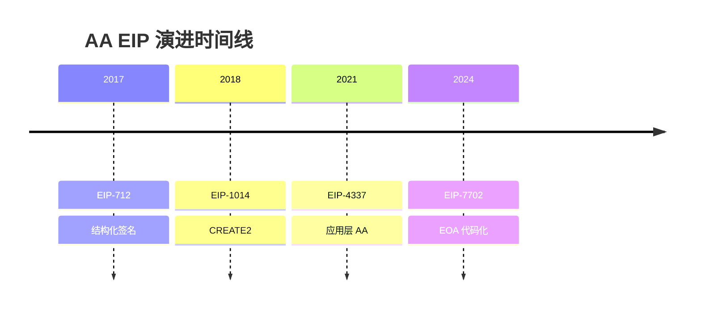

# 图表政策

## 目的

定义本仓库所有研究输出中图表（尤其是 PlantUML）的生成、验证与交付标准，确保所有图表可渲染、可维护，并执行**图表优先、文字补充**的原则。

## 核心原则

### 图表优先原则

**所有研究输出必须遵循图表优先原则**：

1. **先图后文**：能可视化的内容必须先展示图表，再用文字补充图中不易表达的细节
2. **图表承载主干**：演进脉络、架构关系、流程步骤等主干信息必须由图表承载
3. **文字补充细节**：文字只补充图表中不易展示的：
   - 设计原因和 trade-off
   - 失败条件和边界情况
   - 证据等级和不确定性
   - 具体数值和引用来源
4. **禁止文字重复图表**：不得用大段文字完整复述图表已清晰表达的内容

### 分层图表策略

对于复杂主题，必须采用分层图表策略：

1. **主框架图**：展示整体演进脉络/架构全景
2. **子阶段图**：每个关键阶段/子模块有自己的详细图表
3. **对比表格**：特性对比、能力归属等结构化信息优先用表格

## 要求

### 1. 图示方案优先级

**本仓库采用以下图示方案（按优先级排序）**：

#### 第一优先级：PlantUML + Markdown 表格（首选，但仅限有 dedicated skill 支持的类型）

**PlantUML（复杂图首选，但仅限于以下类型）**：

| 类型 | 用途 | 生成方式 | 校验方式 |
|------|------|----------|----------|
| **Architecture Diagram（架构图/组件图）** | 系统架构、组件分层、模块关系 | 必须通过全局 skill `feipi-plantuml-generate-architecture-diagram` | skill 自动执行完整校验链 |
| **Sequence Diagram（时序图/交互图）** | 交互流程、调用链路、消息时序 | 必须通过全局 skill `feipi-plantuml-generate-sequence-diagram` | skill 自动执行完整校验链 |

**约束**：
- **仅限**上述两种类型可以使用 PlantUML
- 必须通过对应的全局 skill 生成和校验
- 禁止手写 PlantUML 代码后未经 skill 完整执行合同就提交
- 推荐使用 diagram-brief 需求模板（详见 skill 内模板）

**Unsupported Types（不支持的 PlantUML 类型）**：

以下类型**没有** dedicated skill 支持，**不得**在正式 draft 中使用 PlantUML 交付：

| 类型 | 原因 | Fallback 方案 |
|------|------|---------------|
| State Diagram（状态机图） | 无 dedicated skill 支持 | 优先 Mermaid → Markdown 表格 → ASCII 草图 |
| Activity Diagram（活动图） | 无 dedicated skill 支持 | 优先 Mermaid → Markdown 表格 → ASCII 草图 |
| Deployment Diagram（部署图） | 无 dedicated skill 支持 | 优先 Mermaid → Markdown 表格 → ASCII 草图 |
| Component Relationship（比较总览图） | 无 dedicated skill 支持 | Markdown 表格 → ASCII 草图 |
| 混合型/自由发挥型 PlantUML | 无 dedicated skill 支持 | 根据内容选择 Mermaid / 表格 / ASCII |

**Markdown 表格**（结构化信息首选）：
- **适用场景**：特性对比、时间线、能力归属、状态对比
- **优势**：零依赖、占用空间最小、所有平台完美支持
- **示例**：

| EIP | 年份 | 问题层 | 状态 | 核心创新 | 与 4337 关系 |
|-----|------|--------|------|----------|-------------|
| EIP-712 | 2017 | Infrastructure | Final | 结构化签名 | 基础依赖 |
| EIP-4337 | 2021 | Execution | Final | Alt mempool | 基准方案 |

#### 第二优先级：Mermaid（简单图备选）

**Mermaid**（简单流程图/时序图/状态图/时间线）：
- **适用场景**：简单流程图、时序图、决策树、时间线、状态机
- **优势**：GitHub 原生支持、语法简洁、自动布局
- **约束**：复杂图表达能力弱于 PlantUML

**Mermaid 时间线示例**：



#### 第三优先级：ASCII/Unicode 图（快速草图）

**ASCII 图**（快速草图/简单关系）：
- **适用场景**：快速草图、简单关系、临时说明
- **优势**：零依赖、版本控制友好、任意编辑器可写
- **示例**：

```
Infrastructure (712) ──┐
                       ├──→ Authorization (1271, 3074)
Deployment (1014) ─────┘
```

### 2. 图表类型要求（按优先级选择方案）

**synthesis 类型必须包含的图表**：

- **演进时间线图**（必须）：优先使用 Markdown 表格或 Mermaid timeline，复杂演进用 PlantUML Architecture skill
- **问题层分布图**（必须）：优先使用 Markdown 表格或 Mermaid graph，复杂分层用 PlantUML Architecture skill
- **演进关系图**（必须）：优先使用 Mermaid 关系图或 PlantUML Architecture skill
- **阶段子图**（推荐）：每个关键阶段有自己的详细图表（Mermaid 或 PlantUML Architecture skill）
- **对比表格**（必须）：**必须使用 Markdown 表格**（特性对比、状态对比）

**primitive 类型必须包含的图表**：

- **组件架构图**（必须）：**必须使用 PlantUML Architecture skill**（展示核心组件、层级关系、角色归属）
- **核心流程图**（必须）：**必须使用 PlantUML Sequence skill**（展示关键交互流程）
- **能力归属表**（必须）：**必须使用 Markdown 表格**（区分协议原生能力与外部依赖）
- **子流程图**（推荐）：复杂流程分解为多个子流程时序图（PlantUML Sequence skill 或 Mermaid）

**domain 类型必须包含的图表**：

- **问题簇划分图**（必须）：优先使用 Markdown 表格或 Mermaid graph
- **与相邻 domain 关系图**（必须）：优先使用 Mermaid 关系图或 PlantUML Architecture skill

**状态机/状态转换图**（如需要）：

- **不得使用 PlantUML**（无 dedicated skill 支持）
- **必须使用**以下 fallback 方案之一：
  - Mermaid stateDiagram
  - Markdown 表格（状态、触发条件、转换结果）
  - ASCII 草图（简单状态机）

### 3. PlantUML 必须通过 skill 生成

- 所有 PlantUML 代码**必须**通过用户级全局 skills 生成：
  - 架构图：`feipi-plantuml-generate-architecture-diagram`
  - 时序图：`feipi-plantuml-generate-sequence-diagram`
- **禁止**直接手写 PlantUML 代码后未经校验就提交
- skill 会自动执行完整校验链（brief 校验、覆盖校验、布局校验、渲染校验）

### 4. 校验标准

**PlantUML 图（通过 skill 交付）**：
- 必须通过 skill 的完整校验链
- 必须产出 diagram package（包含 `validation.json`）
- `validation.json` 必须显示 `final_status=success` 且 `render_result=ok`

**Mermaid 图**：
- 必须通过 GitHub/GitLab 预览验证
- 不得有语法错误

**Markdown 表格**：
- 必须对齐清晰
- 表头语义明确

**ASCII 图**：
- 必须在等宽字体下可读
- 建议标注"ASCII 草图"

### 5. 交付物要求

- `draft.md` 中的 PlantUML 必须嵌入代码块（```plantuml）
- 代码块前必须有 contract comment（详见 draft 模板）
- 必须位于 diagram package 目录下（`diagrams/<id>/`）
- 必须包含 `validation.json` 且显示 success

### 6. 流程集成

- 全局 skill 是 PlantUML 生成与验证的 **source of truth**
- draft 阶段**不能**把 repo-local `scripts/diagrams/check_plantuml.sh` 当正式 gate
- `scripts/diagrams/check_plantuml.sh` 仅用于手工 troubleshooting，不是 pipeline 真相

### 7. 问题追溯

- 若发现 PlantUML 编译失败，视为 skill 执行缺陷
- 修复方案：重新执行 skill 完整流程，而非手工修复

### 8. Unsupported Type 处理

若需要可视化 unsupported type（如状态机图、比较总览图）：

1. **优先选择 Mermaid**（GitHub 原生支持）
2. **其次选择 Markdown 表格**（零依赖、结构化）
3. **最后选择 ASCII 草图**（快速草图）
4. **不得**为了使用 PlantUML 而强行手写

**若未来要支持新的 PlantUML 类型**：

1. 必须先新增 dedicated skill（在 `~/.claude/skills/` 或仓库 skills/）
2. 新增 skill 必须包含完整的校验链（brief、coverage、layout、render）
3. 修改本政策文件，明确新增类型的生成方式
4. 更新 diagram-workflow.md 和 diagram-selection-matrix.md

## 相关文件

- `skills/openspec-research-build-draft/SKILL.md`：必须引用本政策
- `openspec/schemas/blockchain-research/templates/draft.md`：必须提示使用 PlantUML skill
- 用户级 skills (`feipi-plantuml-generate-architecture-diagram` 和 `feipi-plantuml-generate-sequence-diagram`)：图表生成与校验工具
- `openspec/specs/architecture-diagram-quality/spec.md`：架构组件图质量规约（必须遵守）
- `openspec/specs/component-abstraction-level/spec.md`：组件抽象层级规约（必须遵守）
- `openspec/specs/consensus-algorithm-analysis/spec.md`：共识算法分析深度规约（必须遵守）
- `harness/workflows/diagram-workflow.md`：图表创建执行流程
- `harness/rules/diagrams/diagram-selection-matrix.md`：图表选择指南
- `harness/rules/diagrams/diagram-review-checklist.md`：图表评审清单

## 附录：架构组件图质量要求

**架构组件图必须遵守 `openspec/specs/architecture-diagram-quality/spec.md` 中的规定**：

1. **元素类型区分**：组件（蓝色矩形）、数据（黄色 note）、角色（灰色人形）、存储（绿色圆柱体）
2. **分层着色**：通过 package 背景和边框区分层次
3. **箭头语义**：所有箭头必须标注语义和流程序号（S1→Sn）
4. **图例说明**：必须包含图例说明各元素含义
5. **抽象层级**：遵守 `openspec/specs/component-abstraction-level/spec.md`，不得混用不同层级的组件
6. **纵向布局**：使用 `top to bottom direction`

**不符合质量规约的组件图视为未完成**。

## 附录：共识算法分析深度要求

**共识算法 primitive 必须遵守 `openspec/specs/consensus-algorithm-analysis/spec.md` 中的规定**：

1. **流程描述深度**：必须覆盖触发条件、输入消息格式、本地验证、状态转换、超时处理
2. **对比分析深度**：必须回答"为什么 PBFT 需要这个阶段"和"为什么该算法可以省略"
3. **消息格式定义**：必须定义关键消息的结构
4. **状态机定义**：必须定义节点状态转换

**不符合深度要求的分析视为未完成**。

## 附录：PlantUML 支持矩阵

| 类型 | 是否有 dedicated skill | 生成方式 | 校验方式 | 正式交付允许 |
|------|----------------------|----------|----------|-------------|
| Architecture Diagram | ✅ 是 | `feipi-plantuml-generate-architecture-diagram` | skill 自动校验 | ✅ 允许 |
| Sequence Diagram | ✅ 是 | `feipi-plantuml-generate-sequence-diagram` | skill 自动校验 | ✅ 允许 |
| State Diagram | ❌ 否 | Mermaid / 表格 / ASCII | 人工验证 | ❌ 不允许（PlantUML） |
| Activity Diagram | ❌ 否 | Mermaid / 表格 / ASCII | 人工验证 | ❌ 不允许（PlantUML） |
| Deployment Diagram | ❌ 否 | Mermaid / 表格 / ASCII | 人工验证 | ❌ 不允许（PlantUML） |
| 比较总览图 | ❌ 否 | Markdown 表格 / ASCII | 人工验证 | ❌ 不允许（PlantUML） |

**正式交付 = 可以写入 draft.md 并通过校验的图表**

**不允许 PlantUML = 不得使用 PlantUML 手写交付，必须使用 fallback 方案**
