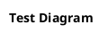

# Test Draft

## 概述

这是一个测试 draft 文件。

## 组件架构图

<!-- verified-diagram: package=./diagrams/test-diagram/validation.json puml=./diagrams/test-diagram/diagram.puml sha256=ccce9288bb1632f485e6d024c8d239a06317b229da0b17edaf413437c326df4d -->

## 结论

测试完成。
