# 生成研究草稿

## 规则来源

本 skill 执行 draft 阶段规则，正式规则来自：

- `openspec/schemas/blockchain-research/schema.yaml` —— change 整体结构
- `openspec/schemas/blockchain-research/templates/draft.md` —— draft 模板
- `harness/workflows/draft-phase.md` —— draft 阶段规范（入口）
- `harness/rules/diagrams/diagram-policy.md` —— 图表政策
- 相关上位规范（见 `draft-phase.md` 中"与上位规范的关系"）

本 skill 不复制上位规范正文，仅负责 Qoder 的触发入口、使用时机与输入输出。

若 `draft-phase.md` 与其引用的上位规范存在差异，以相关上位规范为准。

## 何时使用（Qoder 特定）

- `plan.md` 已经通过 review
- 来源规划已经足以支撑第一轮正文
- 需要把术语、分析、有限结论合并为一次 review

## 输入输出（Qoder 特定）

**输入：**
- 目标 change 目录路径

**输出：**
- `draft.md`（写入目标 change 目录下）
- `diagrams/<diagram-id>/`（如有 PlantUML 图，包含 diagram package）

## 依赖

- PlantUML 生成工具：所有 PlantUML 图必须通过用户级全局 skills 生成和校验
  - `feipi-plantuml-generate-architecture-diagram`（架构图）
  - `feipi-plantuml-generate-sequence-diagram`（时序图）

## PlantUML Diagram 完整执行合同（强制）

**所有 PlantUML 图必须遵守以下合同，否则不得写入 draft.md：**

### 1. 必须使用全局 skill 生成

- 架构图：必须调用 `feipi-plantuml-generate-architecture-diagram` skill
- 时序图：必须调用 `feipi-plantuml-generate-sequence-diagram` skill
- **禁止**直接手写或手改 PlantUML 代码后未经 skill 完整执行合同就提交

### 2. 必须产出 diagram package

- **标准位置**：`openspec/changes/<change-id>/diagrams/<diagram-id>/`
- **必须包含**：
  - `brief.yaml` - 原始 brief
  - `brief.normalized.yaml` - 规范化后的 brief
  - `diagram.puml` - PlantUML 源码
  - `diagram.svg` - 渲染后的 SVG（render_result=ok 时）
  - `validation.json` - 验证结果合同

说明：
- `brief.normalized.yaml` 为推荐保留项；若 skill 未产出，不能伪造
- `validation.json` 是必须保留的 audit 文件

### 3. 必须通过 validation.json 验证

- `final_status=success`
- `render_result=ok`
- `puml_sha256` 与 diagram.puml 一致
- 任一条件不满足，diagram 视为未完成

### 4. 必须在 draft.md 中添加 contract comment

- 每个 PlantUML block 前必须有紧邻的单行 HTML 注释
- **格式固定**：
  ```html
  <!-- verified-diagram: package=./diagrams/<diagram-id>/validation.json puml=./diagrams/<diagram-id>/diagram.puml sha256=<sha256> -->
  ```
- `sha256` 必须与 `validation.json` 中的 `puml_sha256` 一致
- contract comment 与 PlantUML block 之间不得有其他内容

### 5. 必须通过合同校验脚本

- 写完 `draft.md` 后必须执行：
  ```bash
  python3 scripts/research/validate_draft_diagram_contract.py <change-dir>/draft.md
  ```
- 校验通过（返回 0）后才能声称 draft 完成
- 校验失败时必须报告哪一个 block/contract 出错

### 6. 禁止行为

- **禁止**手写一个"看起来像 skill 输出"的 PlantUML block
- **禁止**手改 skill 生成的 diagram.puml 后不重新执行 contract
- **禁止**在 validation.json 未显示 success 时声称 diagram 已完成
- **禁止**绕过 contract comment 直接嵌入 PlantUML block
- **禁止**使用 inline PlantUML（不在 diagram package 中的图）

### 7. 违约处理

- 发现 hand-written PlantUML：视为 draft 未完成，必须删除后重新调用 skill
- 发现手改后 hash 不匹配：视为内容被篡改，必须重新执行 skill 或恢复原始内容
- 发现 validation.json 缺失或失败：必须重新执行对应全局 skill 的完整生成与校验流程

## Diagram Package 标准位置约定

```
openspec/changes/<change-id>/
├── request.md
├── plan.md
├── draft.md                    # 包含 PlantUML blocks 和 contract comments
└── diagrams/
    └── <diagram-id>/           # diagram package 目录
        ├── brief.yaml
        ├── brief.normalized.yaml
        ├── diagram.puml        # PlantUML 源码
        ├── diagram.svg         # 渲染后的 SVG
        └── validation.json     # 验证合同
```

## Contract Comment 格式

每个 PlantUML block 前必须有紧邻的 contract comment：

```markdown

```plantuml
@startuml
...
@enduml
```

<!-- verified-diagram: package=./diagrams/arch-overview/validation.json puml=./diagrams/arch-overview/diagram.puml sha256=abc123... -->

```

**校验脚本会验证：**
1. comment 格式正确
2. validation.json 存在且 `final_status=success` 和 `render_result=ok`
3. PlantUML block 内容的 sha256 与 comment 一致
4. validation.json 的 `puml_sha256` 与 comment 一致

## 执行步骤

1. **读取前置文件**
   - `request.md`
   - `plan.md`
   - `sources/source-review.md`（如有）
   - `sources/excerpts/`（如有）

2. **生成分析内容**
   - 对 primitive 或 mechanism-heavy 内容，先写实体分类表（role / component / data / state / external）
   - 再写图表清单表，明确哪些图是必需、回答什么问题、为什么可省略
   - 先写术语表（表格形式）
   - 再写分析正文
   - 图表优先：能可视化的内容必须先展示图表

   **primitive 四视图最低要求**：
   - 有多角色或 trust assumption → 角色与信任边界总览图
   - 对每个 materially 不同的核心角色族 → 角色内部组件图
   - 有跨角色交互 → 跨角色核心流程图
   - 有显式状态 / round / epoch / timeout / challenge → 状态图或状态表
   - 始终补能力归属表；若复用 canonical 内部组件图，补角色差异表

3. **生成 PlantUML 图（如有需要）**
   - 先写 brief 文件
   - 调用对应的全局 skill 完整流程
   - 读取 `validation.json` 确认 `final_status=success` 且 `render_result=ok`
   - 将 `diagram.puml` 内容复制到 `draft.md` 中
   - 在 block 前添加 contract comment

4. **校验 diagram contracts**
   - 执行 `python3 scripts/research/validate_draft_diagram_contract.py <change-dir>/draft.md`
   - 只有返回 0 才能声称 draft 完成

5. **参考资料链接自动验证（重复执行时必需）**
   - 提取 `draft.md`【参考资料】章节中所有链接
   - 对每个链接检查验证状态标记：
     - 如为 `[未验证]` 或标注"网络限制"、"需手动确认"等，优先按 `source-workflow.md` 使用 `searxng_search_web` 与 `crawl4ai md` 重新验证
     - 如为 `[已验证]`，跳过
   - 根据获取结果更新验证状态：
     - 成功获取并确认内容相关：更新为 `[已验证]`
     - 仍失败：保留 `[未验证]` 并补充具体失败原因（如"网络限制"、"URL 失效"、"需要认证"、"内容不匹配"）
   - 在【完成总结】中报告验证结果（已验证数量、仍为验证数量及原因）

6. **完成总结**
   - 使用了哪个 change 路径
   - 更新了哪些 section
   - diagram contract 校验结果
   - 参考资料链接验证结果
